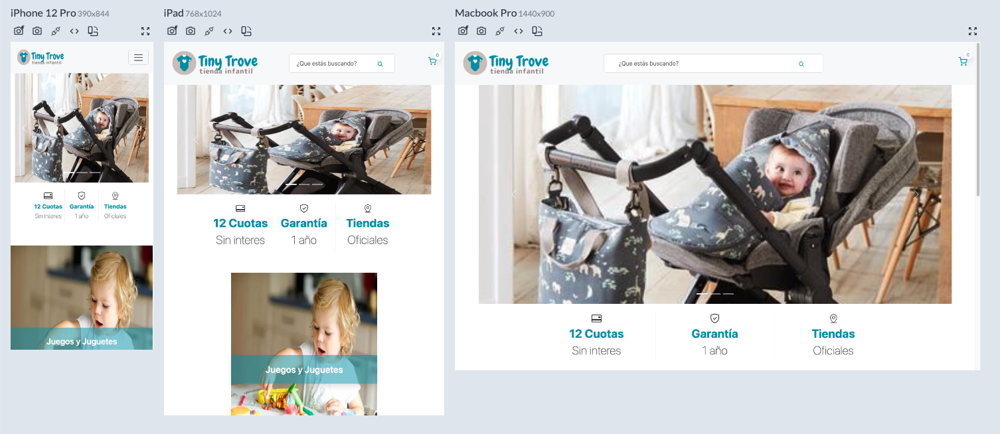
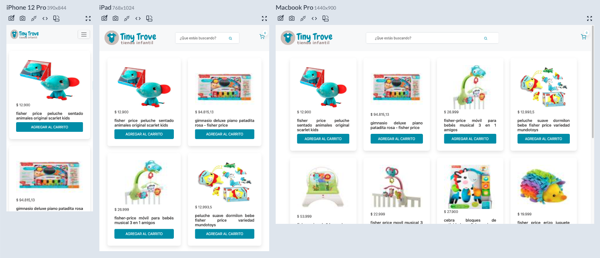
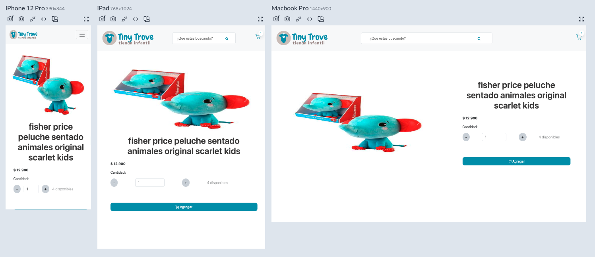
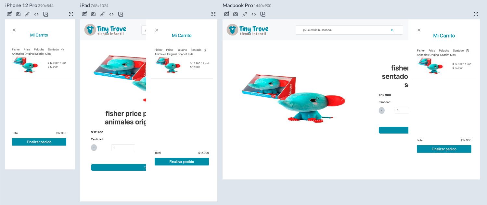
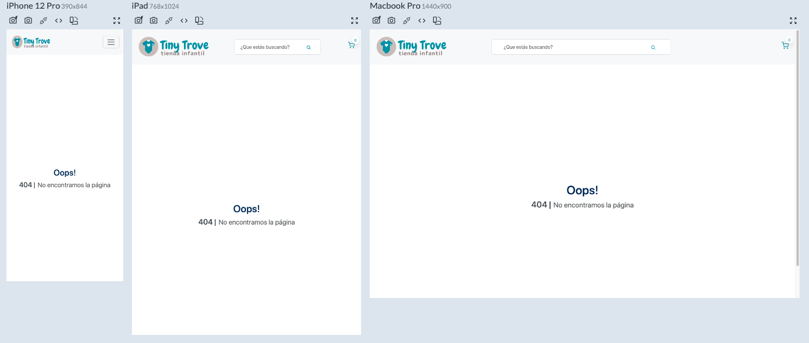

# Tiny Trove Store

  Esta aplicación está desarrollada utilizando Next.js y TypeScript. Utiliza la API pública de Mercado Libre para obtener productos. En la página de inicio, encontrarás un banner con las categorías disponibles y un buscador. Puedes agregar productos al carrito de compras desde la lista de productos o desde la pantalla de detalles del artículo. El carrito se almacena en el almacenamiento local (localStorage), lo que significa que no perderás los datos al recargar la página o cerrar la sesión.
 
<br>

### Wed
<hr>

- **Prueba tú mismo:** [https://tiny-trove-store.netlify.app/](https://tiny-trove-store.netlify.app/)
<br>

<br>

### Clonar Repositorio
<hr>

```bash
  $ git clone https://github.com/andreajhl/tiny-trove-store.git
```
<br>
<br>

### Cómo Probar
<hr>

* Después de clonar el repositorio, accede a la carpeta del proyecto desde tu editor de código favorito.
* En la terminal del proyecto, ejecuta el siguiente comando para instalar las dependencias: ```npm install```.
* Una vez finalizada la instalación, inicia el proyecto con el siguiente comando: ```npm run dev```.
* Si deseas ejecutar las pruebas, utiliza: ```npm run test```
<br>
<br>

### Tecnologías Utilizadas
<hr>

* #### Next.js
* #### TypeScript
* #### SASS
* #### Jest
* #### Bootstrap
<br>
<br>

### Pantallas del Proyecto y Usos
<hr>

* ### Home
<br>

  La página de inicio cuenta con un carrusel de bienvenida, información sobre cuotas y garantía, un banner de categorías para seleccionar y un buscador para traer productos relacionados.
<br>



<br>
<br>


* ### Listado de Productos
<br>

  Ya sea que selecciones una categoría o busques un producto desde el formulario, llegarás a esta página donde encontrarás un listado de productos encontrados (hasta 10 productos por página). Desde aquí, puedes agregar productos al carrito o ir a los detalles del producto haciendo clic sobre el título.
<br>


<br>
<br>

* ### Detalles del Producto
<br>

  En esta pantalla podrás ver más fotos del producto, el porcentaje de descuento (si aplica) y el precio original. También puedes agregar el producto al carrito.
<br>


<br>
<br>

* ### Carrito de Compras
<br>

  El carrito de compras está disponible en toda la aplicación. Basta con tocar el icono del carrito para expandirlo. Aquí podrás ver el precio total, el descuento total (si aplica) y un resumen de todos los artículos agregados.
<br>


<br>
<br>

* ### Página 404
<br>

  Si intentas acceder a una página que no existe, serás redirigido aquí. No te preocupes, puedes volver a la página de inicio desde el logotipo ubicado en la esquina superior izquierda.
<br>


<br>
<br>